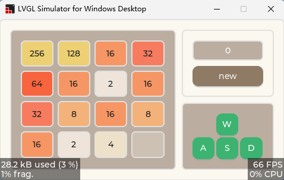

# 2048 Game using lvgl (no animation)

<p align = "center">
	
<br><br>
Why is it called eleven2 ?  -Because 2^11=2048   ;-)


## 概述	

​	这个项目是我了解使用lvgl做的一个简单demo。如果了解过Qt的话就布局来说还是挺简单的。lvgl在keil中也有包，可以直接拿来调用，非常方便。

​	这个工程仅使用了一些简单的组件构建。就工程本身的难度来说可能连入门都算不到，只是熟悉了一些用法而已。

​	阅读lvgl本身提供的demo是一个非常不错的选择，各种实现都非常清晰。期待与大家一起进步😄

<p align = "center">
	
<br><br>

## 看板

- [ ] 🔵 支持动画显示
- [ ] 🔵 加入回退上一步功能
- [ ] 🔵 支持横竖屏布局切换 ()
- [ ] 🟡 加入得分显示
- [ ] 🟡 优化新添数字的功能
- [ ] 🔴 实现基本移动逻辑 
- [x] 🟢 实现UI界面 

## 如何使用？(Visual Studio)

lvgl模拟器 : [lvgl/lv_port_win_visual_studio](https://github.com/lvgl/lv_port_win_visual_studio)

进入工程，编辑文件`LVGL.Simulator.cpp` 

包含头文件

```c
 #include "lv_app_eleven2.h"
```

设置分辨率，改为480*272 (我使用的 [野火4.3inch显示屏 ](https://detail.tmall.com/item.htm?id=622582431607) ) 

```c
if (!lv_win32_init(
        GetModuleHandleW(NULL),
        SW_SHOW,
        480,/*横向分辨率*/
        272,/*纵向分辨率*/
        LoadIconW(GetModuleHandleW(NULL), MAKEINTRESOURCE(IDI_LVGL))))
    {
        return -1;
    }
```

注释掉默认的demo

```c
lv_demo_widgets();// ok
```

调用函数

```c
lv_app_eleven2();
```

 

